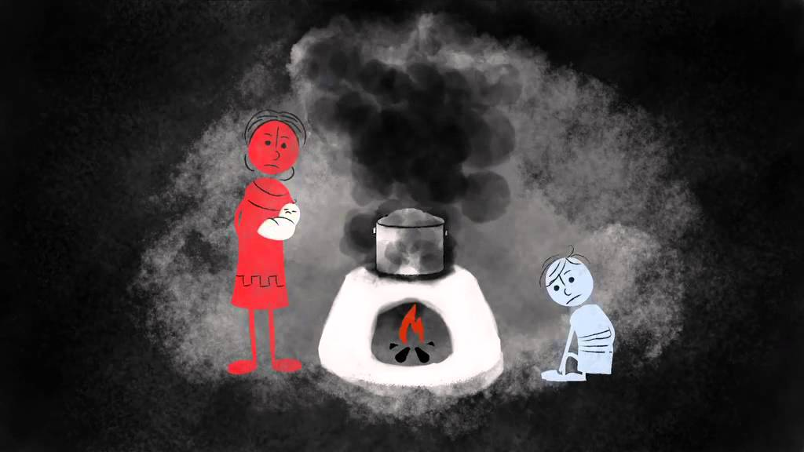

```{r load-packages, include = FALSE}
# Add any additional packages you need to this chunk
# Remove any packages from this list that you're not using
library(tidyverse)
library(tidymodels)
library(knitr)
library(xaringanthemer)
library(readr)
```

```{r setup, include=FALSE}
# For better figure resolution
knitr::opts_chunk$set(
  fig.retina = 3, 
  dpi = 300, 
  fig.width = 6, 
  fig.asp = 0.618, 
  out.width = "70%"
  )
```

```{r load-data, include=FALSE}
 Total_Air_Pollution_Death_Rate <- read_csv("~/R/Project Proposal/data/Total Air Pollution Death Rate.csv")
Household_Air_Pollution_Total_Deaths <- read_csv("~/R/Project Proposal/data/Household Air Pollution Total Deaths.csv")
Household_Air_Pollution_Rate <- read_csv("~/R/Project Proposal/data/Household Air Pollution Rate.csv")
Ambient_Air_Pollution_Rate <- read_csv("~/R/Project Proposal/data/WHO Ambient Air Pollution Rate.csv")
Ambient_Air_Pollution_Total_Deaths <- read_csv("~/R/Project Proposal/data/Ambient Air Pollution Total Deaths.csv")
Particulate_Ambient_Concentration <- read_csv("~/R/Project Proposal/data/Ambient Particulate Concentration.csv")

#Total_Air_Pollution_Death_Rate <- read_csv("~/Project Proposal/project-the-exposure-experience/data/Total Air Pollution Death Rate.csv")
#Household_Air_Pollution_Total_Deaths <- read_csv("~/Project Proposal/project-the-exposure-experience/data/Household Air Pollution Total Deaths.csv")
#Household_Air_Pollution_Rate <- read_csv("~/Project Proposal/project-the-exposure-experience/data/Household Air Pollution Rate.csv")
#Ambient_Air_Pollution_Rate <- read_csv("~/Project Proposal/project-the-exposure-experience/data/WHO Ambient Air Pollution Rate.csv")
#Ambient_Air_Pollution_Total_Deaths <- read_csv("~/Project Proposal/project-the-exposure-experience/data/Ambient Air Pollution Total Deaths.csv")
#Particulate_Ambient_Concentration <- read_csv("~/Project Proposal/project-the-exposure-experience/data/Ambient Particulate Concentration.csv")
```

```{r style-slides, echo = FALSE}
style_xaringan(
  title_slide_background_image = "img/UrbanPollution.jpeg", background_color = "#87CEFA")
```

#Framing the Issue

- Climate change is becoming a more apparent issue and one of the important factors is air pollution
- Air pollution refers to the release of pollutants into the air
- Ambient air pollution and Household air pollution
- Varying effects on human body
- 4th leading cause of mortality and the 5th leading cause of morbidity worldwide
- Low and middle income countries suffering the most

.pull-left[
```{r img1, out.width ="90%", echo=FALSE, message=FALSE, warning=FALSE}
img1_path <- "img/Ambient ap pic.jpeg"
include_graphics(img1_path)
```
]
.pull-right[
]

---
#Research Question
- Investigate air pollution as a cause of mortality globally 
- Focus on two issues:
    - If the level of ambient air pollution concentration is correlated with number of deaths in a population or likelihood of an individual dying 
    - What type of air pollution has the most effect on mortality
    
```{r img2, out.height= "10%", out.width= "50%", fig.align='center', echo=FALSE, message=FALSE, warning=FALSE}
img2_path <- "img/cartoon-air-pollution.jpeg"
include_graphics(img2_path)
```

---
#Dataset
- We combined 6 different data into three main data sets:
    - Ambient Air Pollution
         - Ambient air pollution death rate, gender, country, total deaths, residence type, and level of ambient air pollution
         - Filtered for both sexes and residence type
    - Ambient Air Pollution 2
         - Filtered for males, females, urban, and rural
    - Household Air Pollution
         - Household air pollution death rate, gender, country, and total deaths by household air pollution

```{r img3, out.height= "60%", out.width= "60%", fig.align='center', echo=FALSE, message=FALSE, warning=FALSE}
img3_path <- "img/logo-who.jpeg"
include_graphics(img3_path)
```

---
#Exploratory Graphs
.pull-left[ As seen in the first visualization showing the rates of death due to Ambient Air Pollution, there tends to be a greater amount of countries that have death rates of around 25-30 out of every 100,000 in their population, with very few countries having less than 15 or greater than 75 deaths out of every 100,000.

```{r plot-ambient, warning = FALSE, echo = FALSE, fig.width = 5, fig.height = 4}
Ambient_Air_Pollution_Rate %>%
  filter(Dim2 == "Total", Dim1 == "Both sexes") %>%
  ggplot(aes(x = FactValueNumeric)) +
  geom_histogram(binwidth = 10) +
  geom_histogram(binwidth = 10, fig.width=5,fig.height=5) +
  scale_x_continuous(labels = label_comma()) +
  labs(x = "Rate of Death (out of 100,000)",
       y = "Frequency",
       title = "Rates of Death due to Ambient Air Pollution in 2016")
```
]
.pull-right[This is much more alarming than household air pollution death rates, which tend to center a round 0 for most countries. However, this visualization also shows quite a few countries that have death rates between 50 and 100 deaths out of every 100,000.

```{r plot-household, echo = FALSE, warning = FALSE, fig.width = 5, fig.height = 4}
Household_Air_Pollution_Rate %>%
  filter(Dim2 == "Total", Dim1 == "Both sexes") %>%
  ggplot(aes(x = FactValueNumeric)) +
  geom_histogram(binwidth = 10) +
  geom_histogram(binwidth = 10) +
  scale_x_continuous(labels = label_comma()) +
  labs(x = "Rate of Death (out of 100,000)",
       y = "Frequency",
       title = "Rates of Death due to Household Air Pollution in 2016")
```
]
---
#Confirmation through t-tests

- Goal: To see if the two different types of air pollution had the same impact on mortality and if not which had a larger impact
- We conducted two paired t-tests (one sided and two sided) 
    - Two types of pollution are coming from the same country and measuring the same outcome (deaths)  
    - The two-sided paired t-test confirmed that they had different impacts on mortality
    - The one-sided t-test showed that household air pollution had less of an effect on mortality than ambient air pollution 
    - Goes along with our previous graphs where we noticed the alarming amount of deaths due to ambient air pollution

```{r ex2, fig.align='center', warning=FALSE, message=FALSE, echo=FALSE}
joinedambient1 <- Ambient_Air_Pollution_Rate %>%
  rename(AmbientDeathRate = FactValueNumeric) %>%
  rename(Sex = Dim1) %>%
  rename(CauseofDeath = Dim2) %>%
  select(Location, Sex, CauseofDeath, AmbientDeathRate) %>%
  left_join(Ambient_Air_Pollution_Total_Deaths) %>%
  select(Location, Sex, CauseofDeath, AmbientDeathRate, FactValueNumeric) %>%
filter(CauseofDeath == "Total") %>%
  mutate(totalpopulation = (100000*FactValueNumeric)/AmbientDeathRate) %>%
  rename(Totaldeathsambient = FactValueNumeric)
```

```{r ex3, warning=FALSE, message=FALSE, echo=FALSE}
ambient <- Particulate_Ambient_Concentration %>%
  rename(AmbientAirConcentration = FactValueNumeric) %>%
  select(Location, AmbientAirConcentration) %>%
  left_join(joinedambient1, by = "Location") %>%
  select(Location, Sex, CauseofDeath, AmbientDeathRate, Totaldeathsambient, AmbientAirConcentration, totalpopulation) %>%
filter(CauseofDeath == "Total", Sex == "Both sexes")
```

```{r ex12, warning=FALSE, message=FALSE, echo=FALSE}
household <- Household_Air_Pollution_Total_Deaths %>%
  rename(Totaldeathshoushold = FactValueNumeric) %>%
  select(Location, Totaldeathshoushold) %>%
  left_join(ambient, by = "Location") %>%
  select(Location, Sex, CauseofDeath, Totaldeathsambient, Totaldeathshoushold, totalpopulation) %>%
  select(Location, Sex, CauseofDeath, Totaldeathsambient, Totaldeathshoushold, totalpopulation)%>%
filter(CauseofDeath == "Total", Sex == "Both sexes")
```

```{r two-sided-t-test, echo = FALSE, warning = FALSE}
tests <- list()
tests[[1]] <- t.test(household$Totaldeathshoushold, household$Totaldeathsambient, paired = TRUE, alternative = "two.sided")
```

```{r one-sided-t-test, echo = FALSE, warning = FALSE}
tests[[2]] <- t.test(household$Totaldeathshoushold, household$Totaldeathsambient, paired = TRUE, alternative = "less")
```

```{r ttesttable, echo = FALSE, warning = FALSE}
sapply(tests, function(x) {
     c(x$estimate[1],
       ci.lower = x$conf.int[1],
       ci.upper = x$conf.int[2],
       p.value = x$p.value)
})
```

---
#Binomial Regressions
- Goal: Create a binomial regression model to predict the likelihood of a person dying based on the level of ambient air concentration, gender, and where they live.
```{r ambient-2, echo = FALSE, warning = FALSE}
ambient2 <- Particulate_Ambient_Concentration %>%
  rename(AmbientAirConcentration = FactValueNumeric) %>%
  rename(Residencetype = Dim1) %>%
  select(Location, AmbientAirConcentration, Residencetype) %>%
  left_join(joinedambient1, by = "Location") %>%
  select(Location, Sex, CauseofDeath, AmbientDeathRate, Totaldeathsambient, AmbientAirConcentration, totalpopulation, Residencetype) %>%
filter(CauseofDeath == "Total", !Sex %in% c("Both sexes"), !Residencetype %in% c("Total"))
```

```{r alive, fig.align='center', echo=FALSE, warning=FALSE}
Alive <- ambient2$totalpopulation - ambient2$Totaldeathsambient

modelagg2<-glm(cbind(round(Totaldeathsambient), round(Alive)) ~ AmbientAirConcentration + Sex + Residencetype, data=ambient2, family = binomial)
tidy(modelagg2, conf.int = TRUE, exponentiate = TRUE, format="html")
glance(modelagg2)$AIC
```
$$Likelihoodofdying = 0.0003 + 1.0124(Ambient Air Concentration) + 1.1822(Sex) + 0.9270(Residence Type)$$
- We reject the null hypothesis and conclude ambient air concentration, sex, and residential type are related to mortality
    - p-values are less than alpha = 0.05 and the odds ratio is within the confidence interval
- It is 1.1822 times more likely for males to die than females when the other predictors are held constant 
- It is 0.9270 times more likely for someone living in a urban area to die than someone living in an rural area when the other predictors are held constant

---
#Limitations, Next Steps, and Conclusions
- Conclusions:
    - Air pollution has an impact on mortality
    - Ambient air pollution has a greater effect on mortality than household air pollution. 
    - It is more likely that an individual in an rural community to die due to air pollution than someone living in a urban community 
    - It is more likely for a male to die than a female
- Limitations:
    - Household and ambient air pollution are likely highly correlated, but haven’t learned how to test and adjust for this so this could be affecting the results
    - Didn’t have the data for multiple years 
- Next Steps:
    - Correlation test and gather data from multiple years
    - Gather some training data to test how well our model is predicting individuals

---
#Sources
World Health Organization. “Air Pollution.” World Health Organization, World Health Organization, 22 Sept. 2021, https://www.who.int/health-topics/air-pollution#tab=tab_1. 

State of Global Air. “State of Global Air.” How We Estimate Burden of Disease | State of Global Air, 2021, https://www.stateofglobalair.org/data/estimate-burden.

#Image Sources
https://www.europeanscientist.com/en/environment/urban-pollution-is-having-cascading-effects-on-plant-and-insect-ecosystems/
https://www.youtube.com/watch?v=yp4MiprLRrQ
https://www.miskawaanhealth.com/air-pollution-health-effects/
https://www.google.com/url?sa=i&url=https%3A%2F%2Fwww.who.int%2F&psig=AOvVaw3BPnwS75ov9F4jROlTyOr1&ust=1637307599388000&source=images&cd=vfe&ved=0CAsQjRxqFwoTCOi0-am0ofQCFQAAAAAdAAAAABAD
https://www.everydayhealth.com/type-2-diabetes/is-there-a-link-between-type-2-diabetes-and-air-pollution/
https://www.who.int/

